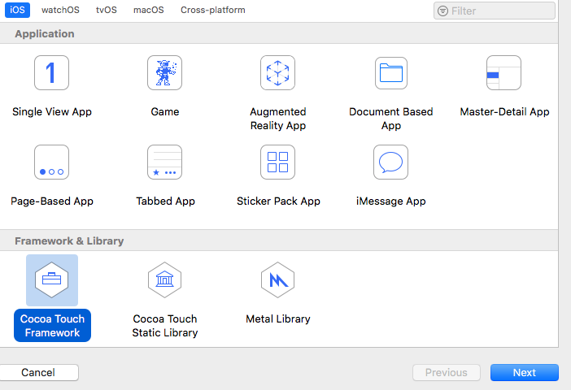
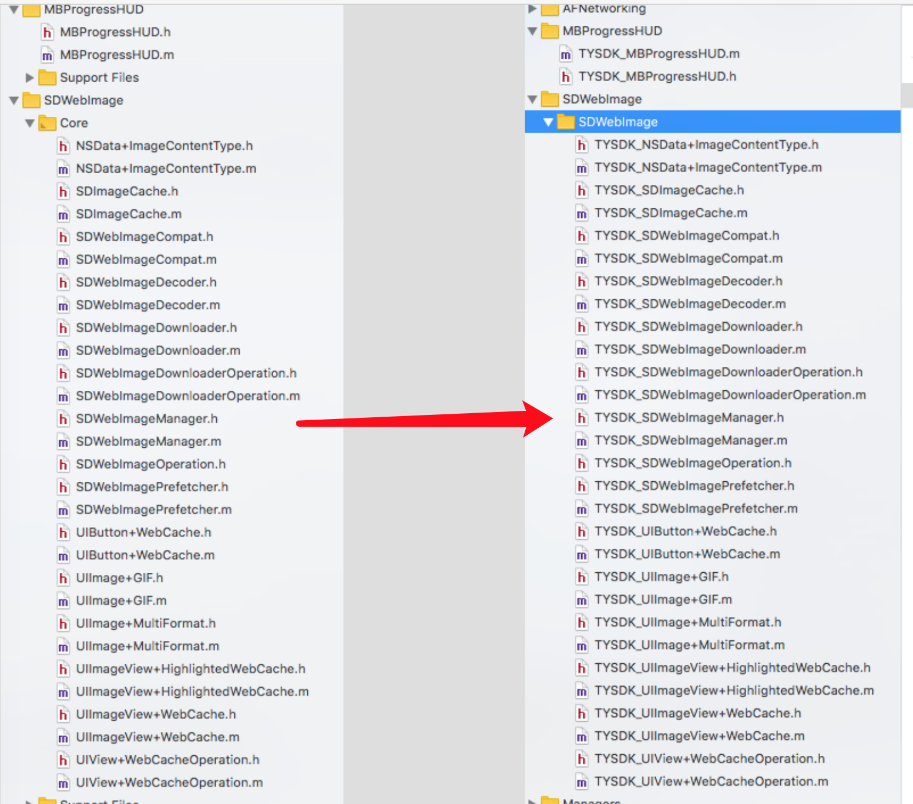
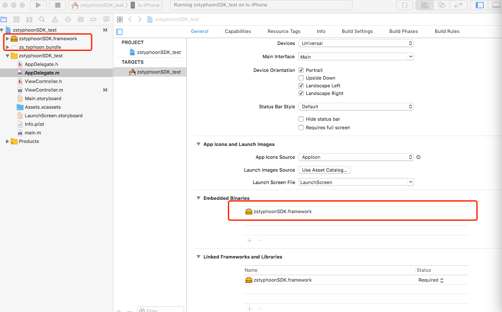

Title: iOS动态库制作
Date: 2018-11-26
Tags: iOS, XCode
Category: iOS
Slug: iOS-framework-create

#### **为什么要使用静态库？**
方便共享代码，便于合理使用。

实现iOS程序的模块化。可以把固定的业务模块化成静态库。

和别人分享你的代码库，但不想让别人看到你代码的实现。

XCode版本：10.1

#### **1，新建工程**


#### **2，文件名、类名加前缀（防止与其它第三方库重名，非必须）**


#### **3，修改Build Phases（主要修改Headers）**
1，需要把供外部调用的类名都放到public中（如：需要调用生成库的TEST_ViewController类，则需要把TEST_ViewController.h移动到Public中）


2，在默认头文件中添加上所有公开头文件的引用
```ObjC
#import <UIKit/UIKit.h>

//! Project version number for zstyphoonSDK.
FOUNDATION_EXPORT double zstyphoonSDKVersionNumber;

//! Project version string for zstyphoonSDK.
FOUNDATION_EXPORT const unsigned char zstyphoonSDKVersionString[];

// In this header, you should import all the public headers of your framework using statements like #import <zstyphoonSDK/PublicHeader.h>


#import <zstyphoonSDK/zstyphoonSDK.h>
#import <zstyphoonSDK/TYSDK_TyphoonNavController.h>

```
#### **4，编译并测试**
1，创建测试项目  
2，添加编译生成的framework文件、bundle资源包  
3，修改设置项Embedded Binaries，添加上动态库  


参考网站：  
https://www.jianshu.com/p/87a412b07d5d