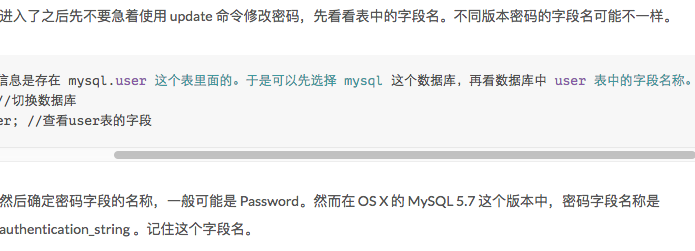

Title: mac 安装mysql后root密码问题
Date: 2016-08-22
Tags: mac, mysql
Category: mysql
Slug: mac 安装mysql后root密码问题
Summary: mac 安装mysql后root密码问题。<br />问题描述：mac上新安装的mysql, 在终端使用命令：`mysql -u root -p` 无法连接到mysql数据库；<br />解决方法：修改密码

问题描述：mac上新安装的mysql, 在终端使用命令：`mysql -u root -p` 无法连接到mysql数据库；

解决方法：修改密码！

步骤：<br />
1，在 设置 中关闭msql服务<br />
2，进入超级管理员用户：
```
sudo su
```
3，进入mysql目录：
```
cd /usr/local/mysql/bin/
```
4，安全启动mysql：
```
./mysqld_safe --skip-grant-tables &
```
5，新打开一个终端，进入 MySQL：
```
mysql -u root -p
```
6，数据库、表说明如下图：


7，修改密码为“root”：
```
update user set authentication_string=PASSWORD('root') where User='root’;
```
8，刷新权限，使配置生效：
```
flush privileges;
```
9，关闭数据库：
```
quit;
```
10，重启mysql：
```
sudo /usr/local/mysql/support-files/mysql.server start
```
11，再次连接：
```
mysql -u root -proot
```
提示错误：<br />
```
ERROR 1820 (HY000): You must reset your password using ALTER USER statement before executing this statement.
```
12，mysql下执行命令：
```
SET PASSWORD = PASSWORD('root');
```

完毕！（:

参考：<br />
1，<http://www.2cto.com/database/201303/197067.html><br />
2，<http://fgyong.cn/2016/01/28/MAC-%E9%87%8D%E7%BD%AEMySQL-root-%E5%AF%86%E7%A0%81/><br />
