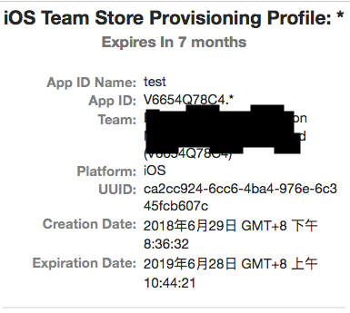

Title: python删除xcode过期证书
Date: 2018-07-11
Tags: python, xcode
Category: python
Slug: python-remove-xcode-expire-profile

apple的企业证书有效期为1年，过期后证书失效、对应安装的企业应用也会过期无法打开，非常有必要定期更新证书：
删除过期（即将过期）的证书
然后创建新的证书（直接修改旧证书没用~）

xcode使用时间长了，`~/Library/MobileDevice/Provisioning Profiles`目录下可能很多过期的`.mobileprovision`证书文件，证书文件在mac上可以预览内容，如下图：  


同样方法也可以用于读取企业应用ipa包过期时间，ipa文件解压出来Payload目录，右键.app文件查看包内容，找到embedded.mobileprovision证书文件，部分内容是plist格式的，使用python可以读出来过期时间`Expiration Date`。

代码如下：
```python
#encoding:utf8
import json,glob,os,time,datetime,shutil,zipfile,biplist,plistlib
import sys
reload(sys)
sys.setdefaultencoding('utf-8')

# 删除
def removeFile(path):
    if os.path.exists(path):
        if os.path.isdir(path):
            shutil.rmtree(path)
        else:
            os.remove(path)

# 得到过期时间
def getExpireTime(embedded_path):
    with open(embedded_path, 'r') as f:
        embedded_txt = f.read()

    embedded_index_0 = embedded_txt.find('<plist')
    embedded_index_1 = embedded_txt.find('</plist>')+len('</plist>')
    embedded_str = embedded_txt[embedded_index_0:embedded_index_1]

    embedded_json = plistlib.readPlistFromString(embedded_str)
    expire_time = embedded_json['ExpirationDate']

    return expire_time

# 解压ipa文件
def unzipipa_get_expire_time(ipa_path):
    zfile = zipfile.ZipFile(ipa_path, 'r')
    zfile.extractall(os.path.dirname(ipa_path))
    app_dir = glob.glob(os.path.dirname(ipa_path) + '/Payload/*')[0]
    expire_time = getExpireTime(app_dir)
    removeFile(os.path.dirname(app_dir))
    return expire_time
    
def remove_xcode_expire_profile():
    profiles_path = '~/Library/MobileDevice/Provisioning Profiles'
    pathList = glob.glob(profiles_path+'/*')

    now_timeint = time.mktime(datetime.datetime.now().timetuple())

    for file_path in pathList:
        expire_time = getExpireTime(file_path)
        expire_timeint = time.mktime(expire_time.timetuple())
        # 删除过过期和还有1个月过期的证书
        if expire_timeint < 30*24*3600+now_timeint:
            print getExpireTime(file_path), file_path.split('/')[-1]
            removeFile(file_path)

if __name__ == '__main__':
    # 删除xcode过期证书
    remove_xcode_expire_profile()
    # 得到企业应用ipa过期时间
    unzipipa_get_expire_time('test.ipa')

```


