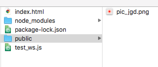

Title: 使用Socket.io实现App与服务器端实时通信
Date: 2017-08-11
Tags: node, js, iOS
Category: node
Slug: 本地搭建Socket.io测试环境，与iOS客户端通信交互

目的：实现手机App控制pc网页交互的功能
方式：websocket长连接
库选择：Socket.io
本地系统：macOS High Sierra 10.13
node版本：v8.2.1

1，创建工程目录`ws-test`;
2，终端`cd ws-test`到工程目录;
3，执行命令`npm install --save socket.io`，安装`Socket.io`;
4，执行命令`npm install --save express`，安装`express`;
5，创建`test_ws.js`使用`express`框架，搭建本地http服务，监听3000端口
```js
var express = require('express');
var path = require('path');

var app = express();
var http = require('http').Server(app);
var io = require('socket.io')(http);

// 配置静态文件目录
app.use(express.static(path.join(__dirname, 'public')));

app.get('/', function(req, res){
  res.sendFile(__dirname + '/index.html');
});

io.on('connection', function(socket){
  io.emit('new user');
  console.log('a user connected');
  socket.on('disconnect', function(){
    console.log('user disconnected');
  });

  socket.on('pointPosition', function(msg){
    io.emit('pointPosition', msg);
  });

  socket.on('screenSize', function(msg){
    io.emit('screenSize', msg);
  });

});

http.listen(3000, function(){
  console.log('listening on *:3000');
});

```
ps：现在还不能在浏览器里访问<http://localhost:3000>，因为还需要一个index.html文件

6，在同一目录下创建文件index.html，当访问<http://localhost:3000>时，显示index.html
```html
<!DOCTYPE html>
<html lang="en">
<head>
  <meta charset="UTF-8">
  <title>jsb_test</title>
  <style>
    img{
      position: absolute;
      top: 50%;
      left: 50%;
    }
  </style>
</head>
<body>
  
</body>
</html>
<script src="https://cdn.bootcss.com/jquery/3.2.1/jquery.min.js"></script>
<script src="https://cdn.bootcss.com/socket.io/2.0.3/socket.io.js"></script>
<script>
   var socket = io();

   socket.on('pointPosition', function(msg){
     var data = JSON.parse(msg)
     var curTop = data.top
     var curLeft = data.left
     $('img').css({
        'top': curTop + 'px',
        'left':curLeft + 'px'
      })
    });

    socket.on('new user', function(msg){
      socket.emit('screenSize', $(window).width()+','+$(window).height());
     });

</script>
```

在浏览器里访问<http://localhost:3000>，将显示index.html
目录结构如下图：


7，App端访问
```objc
// 连接SocketIO服务
self.webSocket = [[SocketIOClient alloc] initWithSocketURL:[NSURL URLWithString:@"http://192.168.1.101:3000"] config:@{@"log": @YES, @"compress": @YES}];
[self.webSocket connect];

// 监听content
[self.webSocket on:@"new user" callback:^(NSArray *data, SocketAckEmitter *act) {
    LOG(@"socket connected");
}];

// 发送消息
[self.webSocket emit:@"pointPosition" with:@[@{@"top":@"100",
                                               @"left":@"100",}]];
```
App发送消息`pointPosition`时，服务端接收消息并分发给所有连接者（包括网页html的连接），网页接收到消息，将会做出相应处理，它会移动到屏幕坐标为(100,100)的位置。
