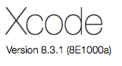
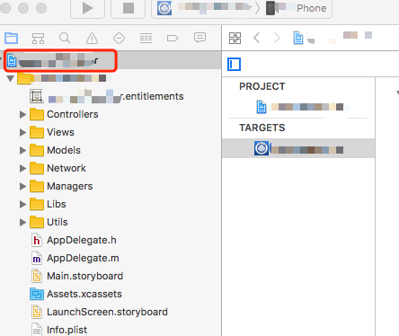
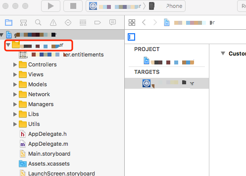
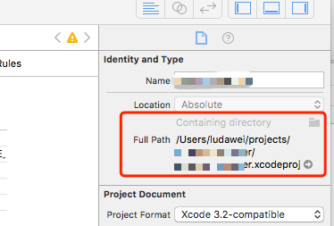

Title: Xcode修改项目名字
Date: 2017-04-20
Tags: Xcode
Category: iOS
Slug: xcode-change-program-name
Summary: Xcode修改项目名字，其实也没那么麻烦~

1，xcode版本  


2，修改工程文件名，直接修改（提示->确定）  


选中工程文件，在右侧的属性栏里修改工程名，如下图  


3，修改工程目录名（分两步）  
a）修改目录名  

b）修改目录指向  


4，如果info.plist路径报错，需要重新选择info.plist  
General->Identity，重新选择info.plist文件  

5，修改PrefixHeader.pch路径  
target->Build Settings->Prefix Header，修改为新的路径  

6，如果有推送，还需要重新生成证书  
Capabilities->Push Notifications，关闭后重新打开一次就好了，删除原来多余的  

Done！Enjoy it~
