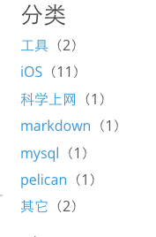

Title: 使用pelican在Github pages上搭建博客遇到的坑
Date: 2016-04-26
Tags: pelican, Github.io, python
Category: pelican
Slug: 使用pelican在Github pages上搭建博客遇到的坑
Summary: 使用pelican在Github pages上搭建博客遇到的坑

**正常步骤参考：**

1，<http://www.xueweihan.com/pelican-build-bolg.html><br />
2，<http://www.wengweitao.com/shi-yong-pelican-github-pagesda-jian-ge-ren-bo-ke.html><br />
3，<http://jinjun.info/pelican-build-blog.html><br />

**以下是实际操作时出现的问题：**

1）安装
```
pip install pelican
pip install markdown
```
2）生成working_dir
```
mkdir blog
cd blog
pelican-quickstart
```

这时报错：
```
*** error: ImportError: No module named html_parser
```
这时只需要更改一下源文件即可：
```
vim /Library/Python/2.7/site-packages/pelican/readers.py
```
将24行的：
```
from six.moves.html_parser import HTMLParser
```
换成：
```
from HTMLParser import HTMLParser
```
即可
3）创建一个测试md文件保存到content目录下，并测试

```
Title: 文章标题
Date: 创建日期
Modified: 修改日期
Category: 文章分类，标志本文处于该分类下
Tags: 文章标签，标志本文处于该标签下
Slug: URL中该文章的链接地址

Author: 作者

这里是博客的内容这里是博客的内容这里是博客的内容这里是博客的内容这里是博客的内容这里是博客的内容这里是博客的内容
```

4）生成静态页面
```
make html
```
5）本地预览，博客全部文件在output目录下
```
make serve
```
通过在浏览器中访问 http://localhost:8000/ 就可以看到你的站点了。<br />
6）部署到github上：将 output目录 整个上传到github page即可<br />
7）访问yourname.github.io 就可以看到你的站点了。<br />

8）绑定域名
>1，在[GoDaddy](https://www.GoDaddy.com)上购买一个域名，并配合DNSPod指向your name.github.io的地址（参考：<http://www.cnblog.me/2015/04/26/dnspod/>）<br />
>2，增加CNAME文件 在repo的根目录下面，新建一个名为CNAME的文本文件，里面写入你要绑定的域名，如：
     www.davlu.com

至此，blog部署应该可以基本完成了；

####**在添加一个静态的html文件（16/06/02更新）**

具体是想实现在`make html`生成静态html时，将已有的静态html文件copy到output目录下即可。
如此，只需要修改Makefile脚本
```
BASEDIR=$(CURDIR)
INPUTDIR=$(BASEDIR)/content
OUTPUTDIR=$(BASEDIR)/output
CONFFILE=$(BASEDIR)/pelicanconf.py
PUBLISHCONF=$(BASEDIR)/publishconf.py
#增加一个常量路径
DIR_TO_COPY=$(BASEDIR)/static_files
```
修改html命令：
```
html:
	$(PELICAN) $(INPUTDIR) -o $(OUTPUTDIR) -s $(CONFFILE) $(PELICANOPTS)
    #复制到 OUTPUTDIR
	cp $(DIR_TO_COPY)/* $(OUTPUTDIR)
```
这样每次make html时，都会自动复制DIR_TO_COPY中的文件到OUTPUTDIR目录下了

####**给每个分类添加文章的数目（16/06/02更新）**
最终效果图：<br />


修改主题目录下对应位置的模板文件`sidebar.html`：
```
<h4>分类</h4>

<ul class="blank">
	
		<li><a href="{{ SITEURL }}/{{ cat.url|e }}">{{ cat }}</a>（{{ null|length }}）</li>
	
</ul>

```
`（{{ null|length }}）`即为新添加的数目,Done!
